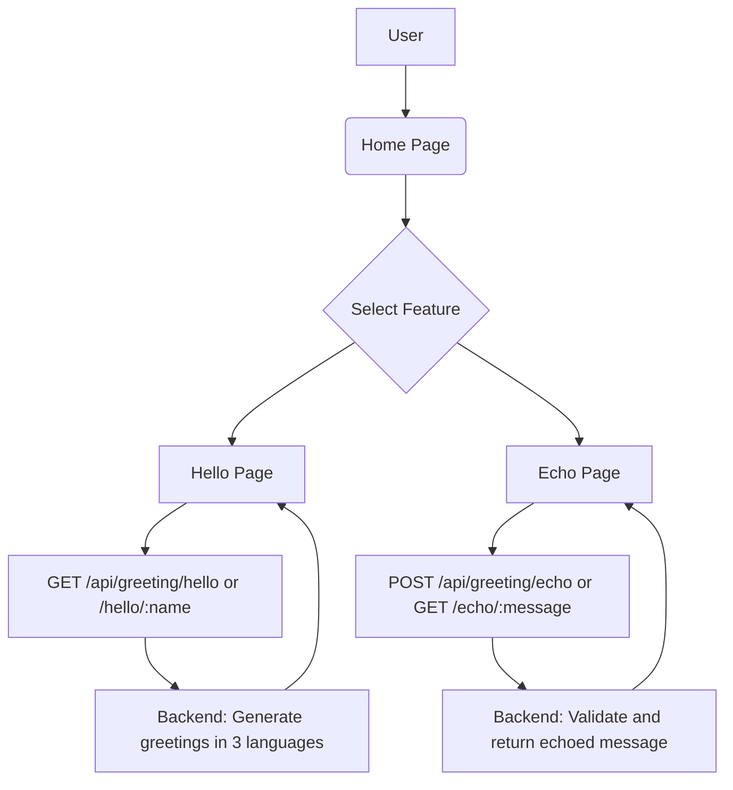

# Functional Specification Document (FSD)  
## Greeting Application  

### Version: 1.0.0  
### Last Updated: January 20, 2025

***

## 1. Purpose

This document defines the functional scope of the Greeting Application, providing detailed descriptions of features and data flows. It aims to ensure all stakeholders align on the application’s functionality and scope before development begins.

***

## 2. Project Overview

The Greeting Application is a user-friendly tool designed to offer multilingual greeting messages and message echoing capabilities. The application is publicly accessible with no login requirements.

***

## 3. Functional Scope and Features

| Feature       | Description                                         |
|---------------|-----------------------------------------------------|
| Home Page     | Landing page offering navigation to Hello and Echo features. |
| Hello Feature | Provides greeting messages in English, Spanish, and French with default and personalized greeting options. |
| Echo Feature  | Echoes back user input messages via POST body or URL parameter with length constraints. |
| Error Handling| Manages input validation and returns meaningful error messages for invalid requests. |
| Logging      | Logs key events and errors with unique request identifiers for traceability. |

***

## 4. Data Flow Diagrams (Mermaid Syntax)

***

## 5. Functional Details

### 5.1 Hello Feature

- **Default Greeting:** Retrieves greetings in three languages for "World."  
- **Personalized Greeting:** Takes an optional user name (max 50 characters) and returns greetings personalized with that name.  
- **Response:** JSON containing success flag and an array of greetings with metadata.  
- **Errors:** Returns validation errors if the name parameter is invalid or missing for personalized greeting.

***

### 5.2 Echo Feature

- **POST Echo:** Receives a message (up to 500 characters) in the request body, validates, and returns it.  
- **GET Echo:** Receives a message (up to 200 characters) as a URL parameter, validates, and returns it.  
- **Response:** JSON success flag and echoed message with metadata.  
- **Errors:** Returns validation errors for missing, empty, or oversized messages.

***

## 6. Assumptions and Constraints

- No authentication required for any feature.  
- Message length limited per feature requirements.  
- Application accessible on web and mobile browsers.  
- Backend APIs follow RESTful principles and return JSON responses.

***

## 7. Project Timeline

| Phase             | Duration         | Description                 |
|-------------------|------------------|-----------------------------|
| Functional Design  | 1 week           | Finalize FSD and obtain signoff |
| Technical Design   | 1 week           | Architecture and detailed design |
| Development       | 4 weeks          | Implement features and unit testing |
| Testing & UAT     | 2 weeks          | Integration, system, and user acceptance testing |
| Deployment       | 1 week           | Production rollout and monitoring |

***

## 8. Approvals

If you are satisfied with the contents of this Functional Specification Document, kindly provide your formal approval by replying to the project email thread. This will serve as the official signoff to proceed with the development phase.

***
