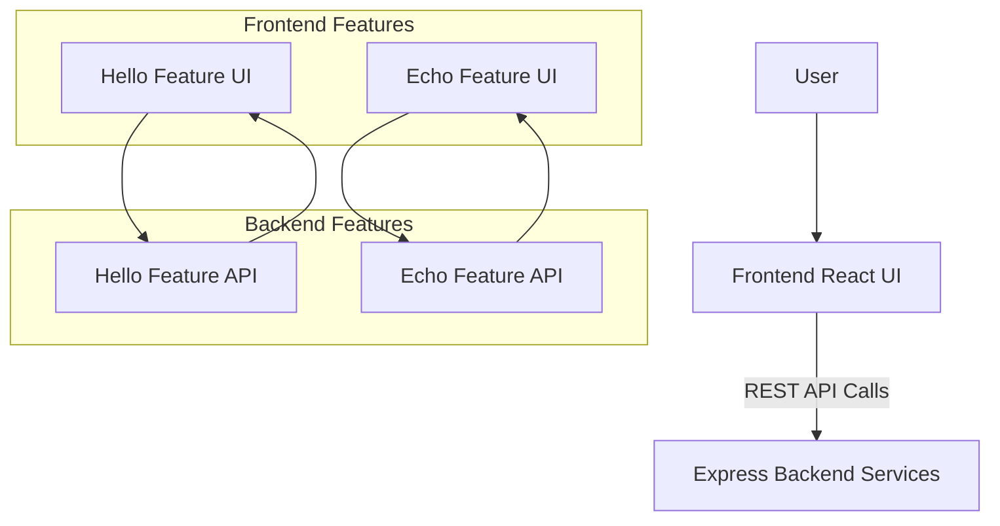

# Technical Specification Document (TSD)  
## Greeting Application — Version 1.0.0  
### Last Updated: August 20, 2025

***

## 1. Architecture Overview

The Greeting Application follows a decoupled architecture based on the Voila Framework. It adopts:

- **Feature-level modularity** for both frontend and backend.  
- **App-level isolation** enabling easy microservice extraction in the future.  
- **Strict REST API contracts** defining interactions between frontend and backend.

***

## 2. Folder Structure

```
src/
├── app/
│   └── greeting/                    # Frontend app folder
│       ├── hello/                  # Hello feature frontend
│       │   ├── hello.routes.tsx    # React Router routes
│       │   ├── hello.services.ts   # API calls and business logic
│       │   ├── hello.types.ts     # Redux slices and types
│       │   ├── hello.contract.json # Frontend contract
│       │   └── components/         # UI components  
│       │       ├── index.tsx
│       │       └── ...             
│       ├── echo/                   # Echo feature frontend
│       │   ├── echo.routes.tsx
│       │   ├── echo.services.ts
│       │   ├── echo.types.ts
│       │   ├── echo.contract.json
│       │   └── components/
│       └── index.tsx               # App entry point
│
├── api/
│   └── greeting/                   # Backend app folder
│       ├── hello/                  # Hello feature backend
│       │   ├── hello.routes.ts
│       │   ├── hello.services.ts
│       │   ├── hello.types.ts
│       │   └── hello.contract.json  # Backend contract
│       ├── echo/                   # Echo feature backend
│       │   ├── echo.routes.ts
│       │   ├── echo.services.ts
│       │   ├── echo.types.ts
│       │   └── echo.contract.json
│       └── server.ts               # Backend server entry
```

***

## 3. Frontend Technology Stack and Guidelines

- **React** with **VoilaJSX UIKit** for UI components.  
- **Redux Toolkit** for state management.  
- **React Router v6** for feature routing.  
- **Tailwind CSS** for styling using utility-first approach, ensuring responsive and maintainable CSS.  
- API interactions strictly follow the JSON schema defined in contracts with Zod validation.

***

## 4. Backend Technology Stack and Guidelines

- **Node.js** with **Express.js** for REST API development.  
- Use **VoilaJSX AppKit** utilities for consistent logging, error handling, input sanitization, and validation.  
- Data validation schemas defined using **Zod**.  
- Strict contract enforcement against frontend API contracts to avoid integration mismatch.  
- Modular, feature-isolated services allowing independent testing and future microservice extraction.

***

## 5. Important Implementation Guidelines

- **Feature Isolation:** Each feature must be self-contained with its own routes, services, models, and contracts on both frontend and backend.  
- **REST API Contract-Driven Development:** Both frontend and backend must adhere strictly to shared contract JSON files; changes must pass validation gates (`voila validate`).  
- **Type Safety:** All data schemas and types should use TypeScript with Zod validation to ensure runtime safety and developer productivity.  
- **Logging and Error Handling:** Use centralized logging via VoilaJSX Logger. All errors should return well-structured responses with meaningful messages for easier debugging.  
- **Security:** Apply input sanitation using VoilaJSX Security mechanisms. Although authentication is not initially required, design the backend to easily add authentication.  
- **Testing:** Achieve at least 95% test coverage on both frontend and backend, covering API, services, and components.  
- **Code Reviews and Validation:** Use automated validation gates integrated into CI pipelines before merges.

***

## 6. Data Flow Diagram (DFD)



***
